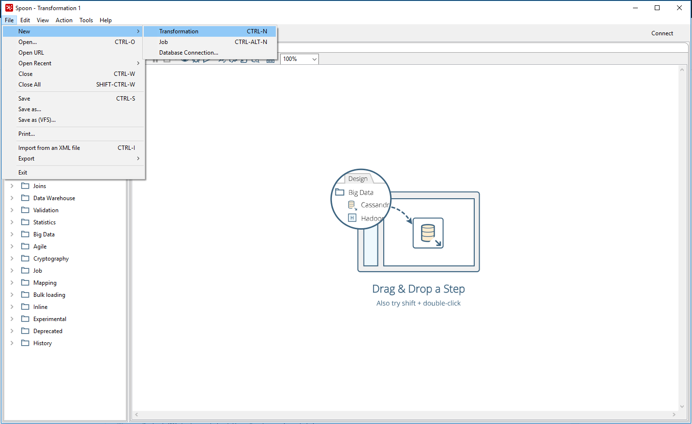
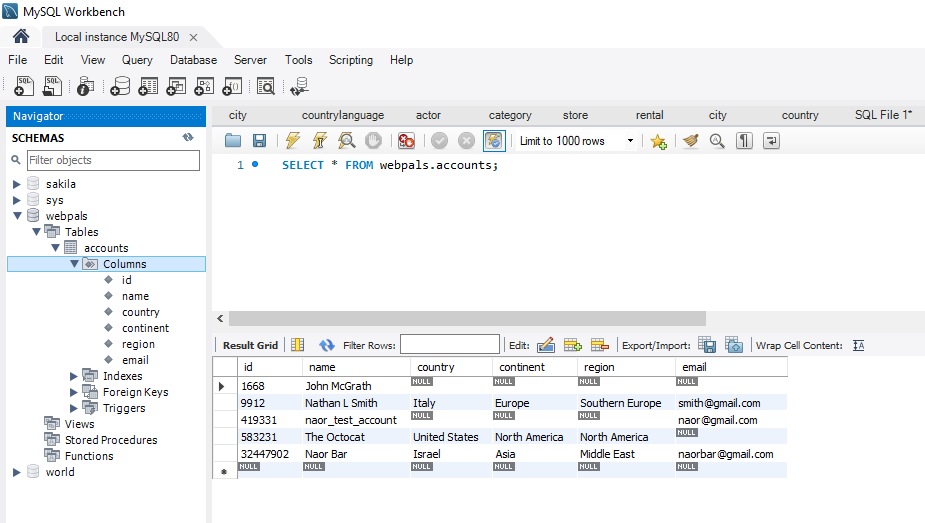
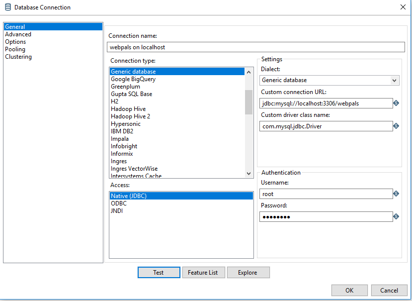

# Data-Integration test for Technical Integrators

THIS IS MASTER

## Overview:
Webpals is looking for an industrial/software/system engineer to be responsible on migrating their exiting CRM solution to Salesforce, and later take ownership on maintaining and implementing new use cases according to the business needs.
This test checks if the candidate is able to:
 - Understand and follow business requirements
 - Learn quickly new material and tools, such as Data Integration, Database installation and REST interface
 - Work under preasure with a tight schedule
 - Activly solve problems independently and efficiently
 - Communicate with co-workers
 
## Purpose:
The purpose of the test is to implement a utility which imports data from json files (to simulate a remote server), transforms the data and export it to a local database (e.g. MySQL).

The utility will be implemented with [PDI](https://www.hitachivantara.com/en-us/products/big-data-integration-analytics/pentaho-data-integration.html) (aka Pentaho Data Integration tool).

## Requirements:
### Inputs:
   - Accounts data as multiple json files
   - Countries data (json file)
### Outputs:
   - A database table containing the accounts data (enriched with the countries information) 

## Follow the next steps:
1. Use this [link](https://sourceforge.net/projects/pentaho/files/latest/download?aliId=137249511) to download and install [PDI tool](https://community.hitachivantara.com/docs/DOC-1009855-data-integration-kettle) (community edition)
2. Use this [link](https://dev.mysql.com/downloads/windows/installer/8.0.html) to download and install MySQL database server (community edition)
3. Download the following json [files](https://github.com/naorbar/data-integration-test/tree/master/json-inputs) and use them as inputs: 
   - xxx.json - each file contains an account and additional information about this account
   - countries.json - a json file contains data about countries, e.g. continent, region, population etc.
4. Open the PDI designer and create a new Transformation (ktr file)
   
5. Implement a flow based on the following use case:
    1. The user gets a list of accounts from multiple json files and a list of countries from a countries.json
    2. The user enriches the data of each account with the relevant country details: continent, region etc.
        hint: use PDI's ['Stream Lookup'](https://wiki.pentaho.com/display/EAI/Stream+Lookup) to merge data from two json inputs 
    3. The user saves the accounts data to a local database table (e.g. MySQL); the output table should look like this:
    

### How to set up a connection to MySQL database:
Follow the next steps to allow PDI to connect with your MySQL database:
1. Get MySQL JDBC driver from [here](https://dev.mysql.com/downloads/connector/j/) 
2. Take the following jar file: mysql-connector-java-8.0.16.jar from the package you just downloaded and put it in PDI lib folder (e.g. pdi-ce-8.2.0.0-342\data-integration\lib)
3. Restart PDI to have it load the jdbc driver (jar file)
4. Set the db connection step (i.e. Table Input or Table Output) with a Generic Connection as shown here:
   
5. Follow this stackoverflow thread to solve any database time zone issue: https://stackoverflow.com/questions/26515700/mysql-jdbc-driver-5-1-33-time-zone-issue
 
## Additional Requirements:
1. Note that the completeness of the test takes precedence over the time limitation.
2. You're encouraged to use the internet; feel free to use any **digital** resource in order to quickly solve technical issues or understand the tools you're using.
3. Please submit the solution (ktr script) via email to: naor.b@webpals.com

**Goodluck** :+1:

ON DEVELOP